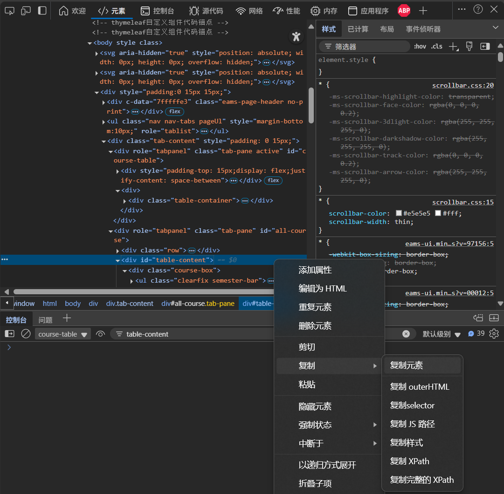

# ECNU-Course-Import-Alternate
## Info
为华师大新教务系统适配的HTML解析工具，从HTML中解析出课程信息，并转换为csv格式，以备后续处理。
## Usage
0. clone the repo

    如果电脑上有`git`，那么`git clone`很合适；如果你不会`git`，那么直接下载代码包也无妨(项目页绿色的`Code`→`Download ZIP`).

    **具体的下载问题恕不赘述，也别问我，网上一搜`GitHub 下载仓库`一类的字眼就有一大堆教程.也别因为这个开Issue.**
1. Install the dependencies | 安装依赖
    
    确保你的电脑上有Python环境 ~~（华师大的学生都要上编程思维与实践，想必电脑上是有Python环境的）~~，且已经安装了`pandas`和`BeautifulSoup4`.
    
    如果没有安装的话，可在项目根目录执行`pip -r requirements.txt`.
    你也可以执行`pip install pandas bs4`.

2. Get your Timetable Data | 获取课程表数据
    
    本人前端技术基本不会，所以只能用这种低效的方法了.
    
    - 打开新系统课程表（课表→我的课表）.

    - 打开开发者工具（按F12或者右键选择“开发人员工具”都ok）.

    - 向下找到`
`，**右键，点击“复制元素”**.
    
    - 熟悉HTML的小朋友都知道，你得到了一些`HTML`结构的数据.
    
        现在在项目根目录新建一个**文本文档**（只要是文本文档就行），把你复制到的东西粘贴进去.

3. Run

    运行脚本，输入数据，得到WakeUp课程表可用的csv文件.

4. Import

    参考WakeUp 课程表官方给出的[教程](https://www.wakeup.fun/doc/import_from_csv.html).

    别忘了你已经得到了csv文件，只要发送到手机上然后导入WakeUp就行了。

## Dev
不难发现脚本里有两个函数可以直接引用：`ECNU_course_resolve_from_HTML(html_content)`，`WakeUp_Timetable_csv_formatting(Timetable)`.

只是一个小小的脚本，感觉没啥好赘述的……

## ToDo

与 [`CourseAdapter`](https://github.com/YZune/CourseAdapter) 对接，写成WakeUp支持的Parser并贡献到官方库. 这样就不用这么麻烦了.

## Acknowledgment

The project is aided with [GitHub Copilot](https://github.com/features/copilot).

**感谢沟槽的树维，但凡能够导出一个Excel格式的课表，甚至是直接支持WebDAV同步课程表（这是极好的），也不需要这样的项目了.**